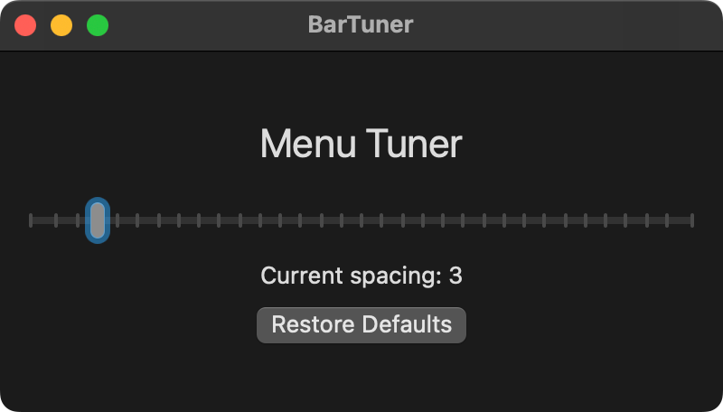

# 为什么要做这个工具？
作为一名 MacBook 用户，相信很多人和我一样被刘海屏带来的一个小问题所困扰：右上角菜单栏的图标间距明显变宽了，看起来不够紧凑。这个细节虽小，却总让我觉得有些不够完美。

见：<a href="https://blog.s1xu.com/sets-menu-bar-spacing/">[macOS]设置菜单栏间距</a>

# BarTuner 诞生记
就这样，BarTuner 诞生了 —— 一个专注于解决单一问题的小工具。

# 核心特性

这个app只有一个功能：调整mac菜单栏间距

- 简单直观：一个功能，一个目的 —— 调整菜单栏图标间距
- 原生支持：使用 Swift 开发，完美适配 macOS
- 轻量级：小巧精致，不占用系统资源

代码已开源在Github，欢迎提issues、pr
https://github.com/s1xu/BarTuner

# 写在最后
有时候，解决一个小问题也能带来不少成就感。BarTuner 虽小，但希望能为同样注重细节的人带来一些帮助。
正如"小而美"的设计理念，有时候最简单的工具反而最实用。

