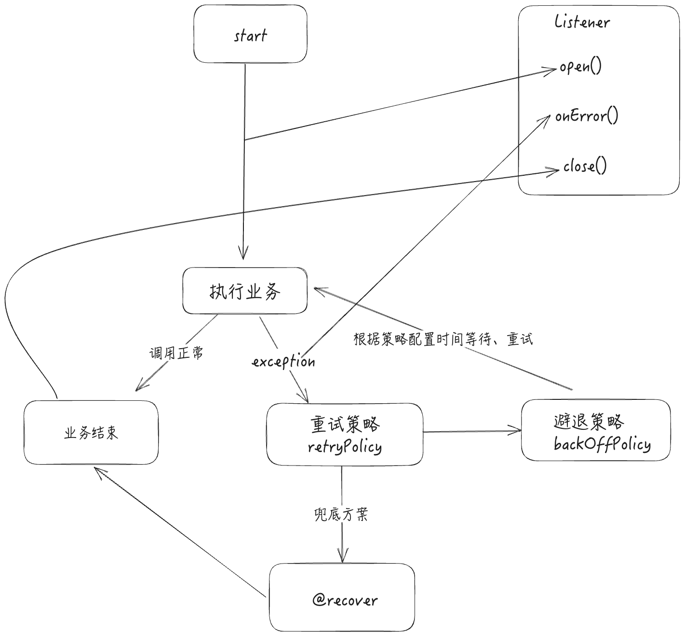

最近项目中使用到了spring retry用来调用三方接口中保证失败重试，增加系统健壮性，简单了解了一下使用。


## 1. 依赖
> 添加spring-retry以及AOP依赖
> [sprint-retry mvn center](https://mvnrepository.com/artifact/org.springframework.retry/spring-retry)
> [spring-aspects mvn center]()
```xml
<dependency>
    <groupId>org.springframework.retry</groupId>
    <artifactId>spring-retry</artifactId>
    <version>2.0.3</version>
</dependency>
<dependency>
    <groupId>org.springframework</groupId>
    <artifactId>spring-aspects</artifactId>
    <version>6.0.11</version>
</dependency>
```

## 2. 使用
### 2. 1 使用RetryTemplate

#### 配置config

```java
@Configuration
@EnableRetry // 启用
public class RetryConfig {

    @Bean
    public RetryTemplate retryTemplate() {
        RetryTemplate retryTemplate = new RetryTemplate();

        // 配置重试策略
        SimpleRetryPolicy retryPolicy = new SimpleRetryPolicy();
        retryPolicy.setMaxAttempts(3); // 设置最大重试次数
        retryTemplate.setRetryPolicy(retryPolicy);

        // 配置退避策略
        ExponentialBackOffPolicy backOffPolicy = new ExponentialBackOffPolicy();
        backOffPolicy.setInitialInterval(1000); // 初始等待时间（毫秒）
        backOffPolicy.setMultiplier(2.0); // 每次重试之间的等待时间乘以2
        backOffPolicy.setMaxInterval(10000); // 最大等待时间（毫秒）
        retryTemplate.setBackOffPolicy(backOffPolicy);

        // 配置重试监听器(可选，附录说明)
        retryTemplate.registerListener(new MyRetryListener());

        return retryTemplate;
    }
}
```
#### 使用RetryTemplate


```java
@Service
public class MyService {

    @Autowired
    private RetryTemplate retryTemplate;

    public void performOperation() {
        retryTemplate.execute((RetryCallback<Void, RuntimeException>) context -> {
            // 这里是需要重试的操作
            performNetworkCall();
            return null;
        });
    }

    private void performNetworkCall() {
        // 模拟网络调用
        System.out.println("Performing network call...");
        // 模拟失败
        throw new RuntimeException("Network call failed");
    }
}
```

#### 附

1. execute方法

```java
public interface RetryOperations {

    <T> T execute(RetryCallback<T> retryCallback) throws Exception;

    ...
}
```

`execute()` 中的 `RetryCallback<T>` （重试回调）参数，它是一个接口，允许插入需要在失败时重试的业务逻辑：

```java
public interface RetryCallback<T> {

    T doWithRetry(RetryContext context) throws Throwable;
}
```

2. Listener

   会在重试的时候进行回调，可以利用这个回调进行日志记录、自定义行为等

   ```java
   public class MyRetryListener implements RetryListener {
   
       @Override
       public <T, E extends Throwable> boolean open(RetryContext context, RetryCallback<T, E> callback) {
           System.out.println("Before Retry");
           return true;
       }
   
       @Override
       public <T, E extends Throwable> void close(RetryContext context, RetryCallback<T, E> callback, Throwable throwable) {
           System.out.println("After Retry");
       }
   
       @Override
       public <T, E extends Throwable> void onError(RetryContext context, RetryCallback<T, E> callback, Throwable throwable) {
           System.out.println("Retry error: " + throwable.getMessage());
       }
   }
   ```

   3. 避退策略
      1. FixedBackOffPolicy 固定时间
      2. ExponentialBackOffPolicy 指数退避策略
      3. ExponentialRandomBackOffPolicy 指数随机退避策略

### 2.2 使用@Retryable注解

#### 配置config

```java
@Configuration
@EnableRetry
public class RetryConfig {
}

//或在启动类上使用@EnableRetry

@SpringBootApplication
@EnableRetry
public class RetryDemoApplication {

    public static void main(String[] args) {
        SpringApplication.run(RetryDemoApplication.class, args);
    }
}
```

#### 使用@Retryable

```java
@Service
public class MyService {

    @Retryable(value = RuntimeException.class, maxAttempts = 3, backoff = @Backoff(delay = 1000))
    public void unstableMethod() {
        System.out.println("Trying to execute unstableMethod");
        if (Math.random() > 0.2) {
            throw new RuntimeException("Service failed");
        }
        System.out.println("Method succeeded");
    }
}
```

> 在抛出 `RuntimeException` 时进行重试，最多重试 3 次，每次重试之间的间隔是 1000 毫秒。


#### 使用@Recover

兜底方案，`@Recover` 注解是 Spring Retry 提供的一个机制，用于定义一个恢复方法，这个方法会在 `@Retryable` 标注的方法重试失败后执行。这样，即使在重试尽量次数之后失败，你还可以有一个后备计划来处理异常情况。

```java
@Service
public class RemoteService {

    @Retryable(value = RemoteAccessException.class, maxAttempts = 3)
    public String callRemoteService() throws RemoteAccessException {
        // 假设这里有代码调用远程服务
        throw new RemoteAccessException("Remote Service Not Available");
    }

    @Recover
    public String recover(RemoteAccessException e) {
        // 当 callRemoteService() 方法重试 3 次失败后，会调用这个方法
        return "Default Response";
    }
}
```

> 注意：`@Recover` 方法必须符合以下条件：
>
> 1. 返回类型应该与 `@Retryable` 方法相同。
>
> 2. 第一个参数应该是导致重试操作失败的异常类型。
>
> 3. 其后的参数应该与 `@Retryable` 方法的参数匹配。


#### 附

1. **`value`**: 指定触发重试的异常类型。这是一个数组，可以指定一个或多个异常类

   ```java
   @Retryable(value = {SQLException.class, IOException.class})
   ```

2. **`include`**: 指定应该触发重试的异常类型，功能同 `value`。

3. **`exclude`**: 指定不应触发重试的异常类型。即使这些异常发生，也不会进行重试。

   ```java
   @Retryable(include = Exception.class, exclude = {IllegalArgumentException.class, IllegalStateException.class})
   ```

4. **`maxAttempts`**: 设置最大重试次数，默认值是 `3`。

5. **`backoff`**: 用于定义重试策略中的退避（Backoff）策略，这影响了重试之间的延迟。可以通过 `@Backoff` 注解来配置。

   - `delay`: 设置两次重试之间的延迟时间（毫秒）。默认为 `1000` 毫秒。
   - `maxDelay`: 设置重试间延迟的最大值。只在 `multiplier` 大于 `1.0` 时有用。
   - `multiplier`: 设置延迟时间增长的系数，用于实现指数退避策略。

   ```java
   @Retryable(backoff = @Backoff(delay = 1000, maxDelay = 5000, multiplier = 2))
   ```

6. **`stateful`**: 如果设置为 `true`，重试将基于异常的状态进行，而不是每次调用都重新计算。状态重试通常用于事务性操作，其中每次重试都需要知道前一次操作的状态。

7. **`listeners`**: 指定重试操作的监听器，这些监听器必须是 `RetryListener` 类型的 Spring Bean 的名字。

   ```java
   @Retryable(listeners = {"MyRetryListener"})
   ```

   > **stateful**默认为false，及无状态重试
   >
   > **例如：**
   >
   > 你正在尝试通过一个自动售货机购买一瓶饮料。你投币后，按下饮料按钮，但由于某种原因（比如机器卡住了），饮料没有掉下来。
   >
   > **无状态重试**
   >
   > 在无状态的情况下，每次你尝试操作时，机器都不会“记得”之前发生了什么。每次尝试购买时，都好像是第一次一样。这就像每次失败后，你都离开售货机，然后又回来重新开始整个购买过程。
   >
   > **有状态重试**
   >
   > 而有状态的重试则不同，它类似于售货机“记住”了你之前投过币，并且知道你已经尝试按过按钮。所以当你再次尝试时，它不会要求你重新投币，而是从上次尝试失败的地方继续尝试，比如直接尝试再次释放饮料。
   >
   > 
   >
   > `stateful` 重试的概念与此类似。如果你的操作因为某些外部问题（比如网络问题）失败了，设置了 `stateful` 为 `true` 的重试会“记住”之前的操作状态。当你再次尝试相同操作时，它不是从头开始，而是尝试从之前失败的地方继续完成任务。
   >
   > 这种类型的重试特别适用于那些需要连续状态或上下文来完成的操作，比如处理一系列需要连续的步骤的在线交易。在这些情况下，简单地重新开始可能会导致问题，如重复操作或数据不一致。

#### spring retry 流程


## 3. 参考

1. [springdoc](https://springdoc.cn/spring-retry-guide/#google_vignette)
